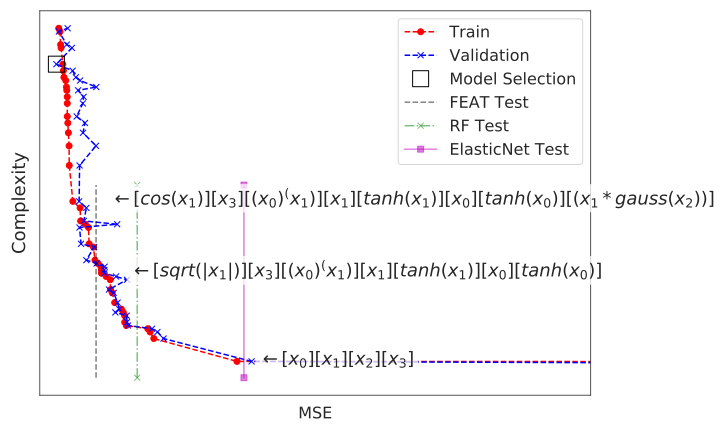

# Using the Archive

In this example, we apply Feat to a regression problem and visualize the archive of representations. 

*Note: this code uses the [Penn ML Benchmark Suite](https://github.com/EpistasisLab/penn-ml-benchmarks/) to fetch data. You can install it using `pip install pmlb`.*

Also available as a [notebook](archive.ipynb)

## Training Feat

First, we import the data and create a train-test split.

```python
from pmlb import fetch_data
from sklearn.model_selection import train_test_split
from sklearn.metrics import mean_squared_error as mse
import numpy as np

dataset='690_visualizing_galaxy'
X, y = fetch_data(dataset,return_X_y=True)
X_t,X_v, y_t, y_v = train_test_split(X,y,train_size=0.75,test_size=0.25,random_state=42)
```

Then we set up a Feat instance and train the model, storing the final archive. 

```python
from feat import Feat
# fix the random state
random_state=11314

fest = Feat(pop_size=500,	# train 500 representations
            gens=100,                  # maximum of 200 generations
            max_time=60,              # max time of 1 minute
            ml = "LinearRidgeRegression",   # use ridge regression (the default)
            sel='lexicase',                 # use epsilon lexicase selection (the default)
            surv='nsga2',                   # use nsga-2 survival (the defaut)
            max_depth=6,                    # constrain features to depth of 6
            max_dim=min([X.shape[1]*2,50]), # limit representation dimensionality
            random_state=random_state,
            backprop=True,                 # use gradient descent to optimize weights
            iters=10,
            n_threads=4,                   # max 1 threads
            verbosity=2,                   # verbose output
            logfile='feat_'+dataset+'.log', # save a log file of the training loss
            print_pop=1                    # print the final population
           ) 

# train the model
fest.fit(X_t,y_t)

# get the test score
test_score = {}
test_score['feat'] = mse(y_v,fest.predict(X_v))

# store the archive
str_arc = fest.get_archive()
```

For comparison, we can fit an Elastic Net and Random Forest regression model to the same data:

```python
# random forest
rf = RandomForestRegressor(random_state=987039487)

rf.fit(X_t,y_t)

test_score['rf'] = mse(y_v,rf.predict(X_v))

# elastic net
linest = ElasticNet()

linest.fit(X_t,y_t)

# test_score={}

test_score['elasticnet'] = mse(y_v,linest.predict(X_v))

```

## Visualizing the Archive

Let's visualize this archive with the test scores. This gives us a sense of how increasing the representation 
complexity affects the quality of the model and its generalization. 

```python
import numpy as np
import matplotlib
import matplotlib.pyplot as plt
import seaborn as sns
matplotlib.rcParams['figure.figsize'] = (10, 6)
%matplotlib inline 
sns.set_style('white')
complexity = []
fit_train = []
fit_val = []
fit_test = []
eqn = []
h = plt.figure(figsize=(10,6))

# store archive data from string
for s in str_arc.split('\n')[1:-1]:
    line = s.split('\t')
    complexity.append(int(line[0]))
    fit_train.append(float(line[1]))
    fit_test.append(float(line[2]))
    eqn.append(','.join(line[3:]))
    eqn[-1].replace('sqrt','\sqrt')

# plot archive points 
plt.plot(fit_train,complexity,'--ro',label='Train',markersize=6)
plt.plot(fit_test,complexity,'--bx',label='Validation')
best = np.argmin(np.array(fit_test))
print('best:',complexity[best])
plt.plot(fit_test[best],complexity[best],'sk',markersize=16,
		 markerfacecolor='none',label='Model Selection')

# test score lines
y1 = -1
y2 = 58
plt.plot((test_score['feat'],test_score['feat']),(y1,y2),
		 '--k',label='FEAT Test',alpha=0.5)
plt.plot((test_score['rf'],test_score['rf']),(y1,y2),
		 '-.xg',label='RF Test',alpha=0.5)
plt.plot((test_score['elasticnet'],test_score['elasticnet']),(y1,y2),
		 '-sm',label='ElasticNet Test',alpha=0.5)

print('complexity',complexity)
eqn[best] = '0)]$\n$'.join(eqn[best].split('0)]'))
# complexity[-1] = complexity[-1]-10 # adjust placement of last equation
xoff = 70
for e,t,c in zip(eqn,fit_test,complexity):
    if c in [1,5,12,31,43,53]:
        if c == 5 or c == 1: 
            t = t+200
        if c==complexity[best]: 
            tax = plt.text(t+18000,c-5,'$\leftarrow'+e+'$',
						   size=18,horizontalalignment='right')
            tax.set_bbox(dict(facecolor='white', alpha=0.75, edgecolor='none'))
        elif c == 43:
            plt.text(t+xoff,c-1,'$\leftarrow$ overfitting',size=18)
        else:
            tax = plt.text(t+xoff,c-1,'$\leftarrow'+e+'$',size=18)
            tax.set_bbox(dict(facecolor='white', alpha=0.75, edgecolor='none'))

l = plt.legend(prop={'size': 16},loc=[0.72,0.05])
plt.xlabel('MSE',size=16)
# plt.gca().set_ylim(10,200)
plt.gca().set_xlim(150,right=20000)
# plt.gca().set_yscale('log')
plt.gca().set_xscale('log')

# plt.ylim(y1,y2)
plt.gca().set_yticklabels('')
plt.gca().set_xticklabels('')

plt.ylabel('Complexity',size=18)
h.tight_layout()
h.savefig('archive_example.svg')

plt.show()
```

This produces the figure below. Note that ElasticNet produces a similar test score to the linear representation
in Feat's archive, and that Random Forest's test score is near the representation [tanh(x_0)][tanh(x_1)]. The
validation curve shows how models begin to overfit as complexity grows.



