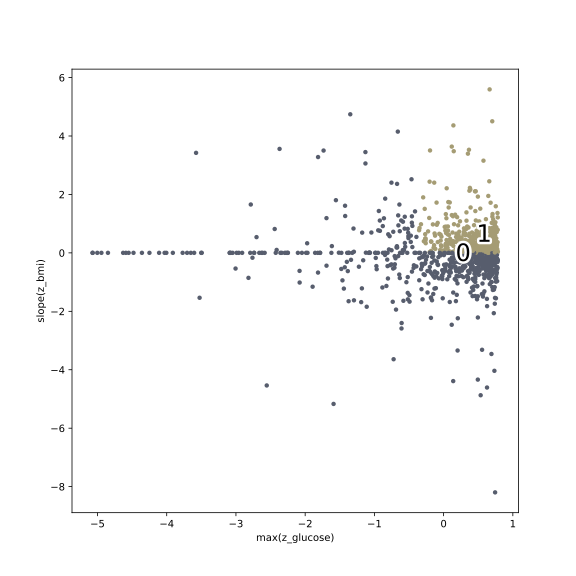

This example demonstrates how to do cross validation with longitudinal data. 

[View source](https://github.com/lacava/feat/tree/master/docs/examples/longitudinal)

## Example Patient Data

First, we generate some example data and store it. Let's imagine we have patient data from a 
hospital. This means we have measurements from different visits, with different numbers of 
measurements from different patients collected in non-uniform intervals. 

In this example, we make up a classification rule that says that each patient with an 
increasing body mass index (BMI) and a high maximum glucose level in their blood panel will be
assigned as a case (class = 1). 

```python
import numpy as np
import pandas as pd
from scipy.stats import rv_continuous, rv_discrete

def make_classification(pdict, data_long):
    """return a classification"""
    # if patient has a max glucose higher than 0.6 and a bmi slope > 0, classify true
    ld = [d for d in data_long if d['id'] == pdict['id']]
    bmis = []
    dates = []
    glucmax = 0
    for d in ld:
        if d['name'] == 'bmi':
            bmis.append(d['value'])
            dates.append(d['date'])
        elif d['name'] == 'glucose':
            glucmax = max(glucmax, d['value'])
    bmis = np.array(bmis)

    dates = np.array(dates)
    bmislope = np.cov(bmis,dates,ddof=0)[0,1]/np.var(dates) 
    return 1 if bmislope > 0.0 and glucmax > 0.8 else 0

if __name__ == '__main__':
    np.random.seed(42)
    # generate data
    ptid = np.arange(1000)
    measurements=['bmi','age','glucose']
    data=[]
    data_long=[]

    for p in ptid:
        # tabular data
        pdict = {}
        pdict['id']=p
        pdict['sex']=np.random.randint(0,2)
        pdict['race']=np.random.randint(0,6)
        data.append(pdict)
        # long data 
        age = np.random.randint(18,85)
        date = np.random.randint(1000,5000)

        for visit in np.arange(np.random.randint(1,20)):
                    
            age = age + np.random.randint(1,4) 
            date = date + np.random.randint(365,3*365) 
            
            for m in measurements:
                plongdict={}
                plongdict['id'] = p
                plongdict['name']=m
                plongdict['date']=date 
               
                if m == 'bmi':
                    plongdict['value'] = int(visit*np.random.randn()) + 40
                elif m == 'age':
                    plongdict['value'] = age
                elif m == 'glucose': 
                    plongdict['value'] = np.random.rand() 
                
                data_long.append(plongdict)
     
        pdict['class']= make_classification(pdict, data_long) # np.random.randint(0,2)
    df = pd.DataFrame.from_records(data, index='id', columns=['id','sex','race','class'])
    df_long = pd.DataFrame.from_records(data_long, index='id', 
										columns=['id','name','date','value'])
    df.sort_index(axis=0,inplace=True)   
    df.to_csv('d_example_patients.csv')
    print(np.sum(df['class']==0),'controls,',np.sum(df['class']==1),'cases')
    #shuffle rows
    df_long.to_csv('d_example_patients_long.csv')
```

## Cross validation

Next we set up the learner. We need to declare the longitudinal operators we want to search over. 
They are defined as a comma-delimited list of strings using the `functions` argument. In this case, 
the operators on the second row of the declaration below all operate on longitudinal data.

```python
import pandas as pd

import numpy as np

from feat import Feat
from sklearn.model_selection import StratifiedKFold

df = pd.read_csv('d_example_patients.csv')
df.drop('id',axis=1,inplace=True)
X = df.drop('class',axis=1).values
y = df['class'].values
zfile = 'd_example_patients_long.csv'
kf = StratifiedKFold(n_splits=3)
kf.get_n_splits(X)

clf = Feat(max_depth=5,
           max_dim=min(50,2*X.shape[1]),
           gens = 20,
           pop_size = 100,
           verbosity=1,
           shuffle=True,
           ml='LR',
           classification=True,
           feature_names = ','.join(df.drop('class',axis=1).columns),
           functions="+,-,*,/,exp,log,and,or,not,=,<,<=,>,>=,ite,split,split_c,"
                     "mean,median,max,min,variance,skew,kurtosis,slope,count",
           backprop=True,
           iters=10,
           random_state=42,
           n_threads=1)
```

Now we train a model using Kfold cross validation. 

```python
scores=[]

for train_idx, test_idx in kf.split(X,y):
    # print('train_idx:',train_idx)
    clf.fit(X[train_idx],y[train_idx],zfile,train_idx)
    scores.append(clf.score(X[test_idx],y[test_idx],zfile,test_idx))

print('scores:',scores)
```

The output looks like this:
	
	reading d_example_patients_long.csv...
	read 30717 lines of d_example_patients_long.csv
	stored 20532 lines, skipped 10185
	Completed 100% [======================================================================]
	reading d_example_patients_long.csv...
	read 30717 lines of d_example_patients_long.csv
	stored 10185 lines, skipped 20532
	reading d_example_patients_long.csv...
	read 30717 lines of d_example_patients_long.csv
	stored 20100 lines, skipped 10617
	Completed 100% [======================================================================]
	reading d_example_patients_long.csv...
	read 30717 lines of d_example_patients_long.csv
	stored 10617 lines, skipped 20100
	reading d_example_patients_long.csv...
	read 30717 lines of d_example_patients_long.csv
	stored 20802 lines, skipped 9915
	Completed 100% [======================================================================]
	reading d_example_patients_long.csv...
	read 30717 lines of d_example_patients_long.csv
	stored 9915 lines, skipped 20802
	scores: [18.407151361726235, 18.151251136485943, 16.59542398484813]

## Model Interpretation
 
Now let's fit a model to all the data and try to interpret it. 

```python
print('fitting longer to all data...')
clf.gens = 20
clf.verbosity = 2
clf.fit(X,y,zfile,np.arange(len(X)))

```

The final output shows

	Generation 19/20 [//////////////////////////////////////////////////]
	Min Loss	Median Loss	Median (Max) Size	Time (s)
	6.81307e-01	6.86632e-01	8 (31) 		25.62887
	Representation Pareto Front--------------------------------------
	Rank	Complexity	Loss	Representation
	1	1	7.08447e-01		[sex]
	1	2	6.92324e-01		[max(z_glucose)]
	1	4	6.91872e-01		[max(z_glucose)][max(z_glucose)]
	1	5	6.91332e-01		[(max(z_age)==min(z_bmi))]
	1	7	6.90810e-01		[min(z_bmi)][(max(z_age)==min(z_bmi))]
	1	10	6.90427e-01		[max(z_glucose)][slope(z_bmi)]
	1	12	6.87921e-01		[((median(z_age)-min(z_bmi))<3.889650)]
	1	14	6.87917e-01		[min(z_bmi)][((median(z_age)-min(z_bmi))<3.889650)]
	1	22	6.85235e-01		[max(z_glucose)][slope(z_bmi)][((median(z_age)-min(z_bmi))<3...
	1	24	6.85218e-01		[max(z_glucose)][slope(z_bmi)][min(z_bmi)][((median(z_age)-m...
	1	28	6.84598e-01		[slope(z_bmi)][slope(z_bmi)][((median(z_age)-min(z_bmi))<3.8...
	1	30	6.84056e-01		[max(z_glucose)][slope(z_bmi)][slope(z_bmi)][((median(z_age)...
	1	36	6.83882e-01		[slope(z_bmi)][slope(z_bmi)][slope(z_bmi)][((median(z_age)-m...
	1	70	6.83480e-01		[max(z_glucose)][((variance(z_age)/skew(z_bmi))>(kurtosis(z_...
	1	72	6.83378e-01		[max(z_glucose)][min(z_bmi)][((variance(z_age)/skew(z_bmi))>...
	1	75	6.82466e-01		[min(z_bmi)][((variance(z_age)/skew(z_bmi))>(kurtosis(z_age)...
	1	76	6.82049e-01		[slope(z_bmi)][((variance(z_age)/skew(z_bmi))>(kurtosis(z_ag...
	1	134	6.81307e-01		[((median(z_age)-min(z_glucose))<-10.132311)][((variance(z_a...


	finished
	best training representation: [((median(z_age)-min(z_glucose))<-10.132311)][((variance(z_age)/skew(z_bmi))>(kurtosis(z_age)-skew(z_age)))][((median(z_age)-min(z_bmi))<3.889650)][((slope(z_bmi)<-240.605220) AND (sex OR NOT(sex)))]
	train score: 0.681307
	updating best..
	best validation representation: [max(z_glucose)][slope(z_bmi)]
	validation score: 0.690144
	final_model score: 0.690150

Here our final representation is composed of `slope(z_bmi)` and `max(z_glucose)`, both of which 
we know to be correct features for this simulated dataset. The best training representation
displays clear overfitting, highlighting the importance of using archive validation for model selection.
 
To see the representation again, we run `clf.get_representation()`, which produces the string
	
	[max(z_glucose)][slope(z_bmi)]

We can also look at the representation with the model weights, sorted by magnitude, using
`clf.get_model()`:
	
	Feature	Weight
	slope(z_bmi)	-1.420572
	max(z_glucose)	-0.705487

## Visualizing the representation

Here we take the two relevant features and plot the data with them. 

```python
proj = clf.transform(X,zfile,np.arange(len(X)))

#scale the projection to zero mean, unit deviation
from sklearn.preprocessing import StandardScaler
proj = StandardScaler().fit_transform(proj)
print('proj:',proj.shape,proj)

# plot
import matplotlib.pyplot as plt
import seaborn as sns
import matplotlib.patheffects as PathEffects


# We choose a color palette with seaborn.
palette = np.array(sns.color_palette("cividis", 2))

# We create a scatter plot.
f = plt.figure(figsize=(8, 8))
ax = plt.subplot(aspect='equal')
sc = ax.scatter(proj[:,0], proj[:,1], lw=0, s=20,
                c=palette[y.astype(np.int)])
ax.axis('square')
# ax.axis('off')
ax.axis('tight')

# We add the labels for each digit.
txts = []
for i in range(2):
    # Position of each label.
    xtext, ytext = np.median(proj[y == i, :], axis=0)
    txt = ax.text(xtext, ytext, str(i), fontsize=24)
    txt.set_path_effects([
        PathEffects.Stroke(linewidth=5, foreground="w"),
        PathEffects.Normal()])
    txts.append(txt)

# add labels from representation
rep = [r.split('[')[-1] for r in clf.get_representation().split(']') if r != '']
print('rep:',rep)
plt.xlabel(rep[0])
plt.ylabel(rep[1])

plt.savefig('longitudinal_representation.svg', dpi=120)
```

This produces the figure below. 


*Data plotted on the axes (slope(z_bmi), max(z_glucose)).*
